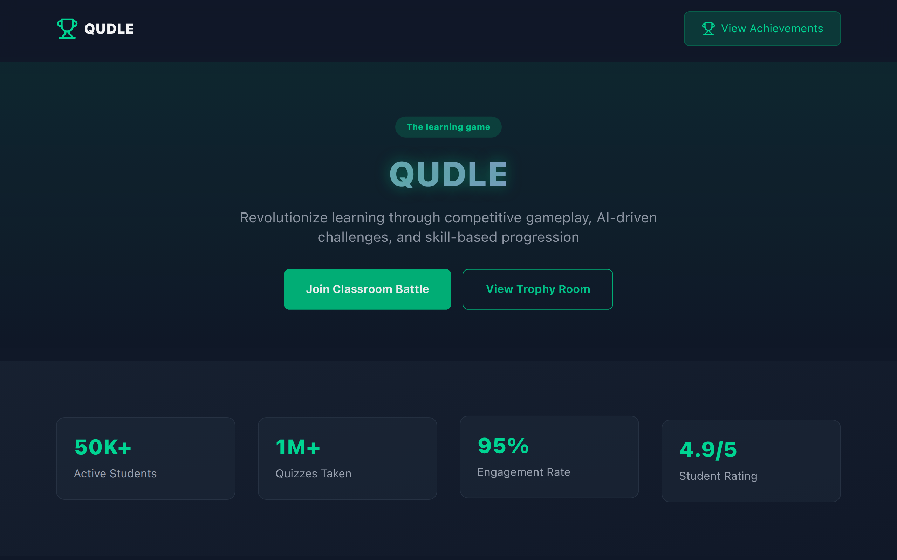
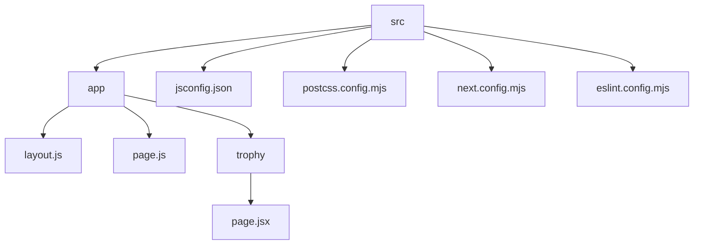

# Qudle: A Modern Web Application

## 🗂️ Description

Qudle is a cutting-edge web application built with Next.js, TypeScript, and Tailwind CSS. It's designed to provide a seamless user experience, featuring a responsive layout, interactive components, and a robust tech stack. This project is perfect for developers looking for a solid foundation to build upon.

Qudle's primary goal is to showcase a well-structured and maintainable codebase, making it an excellent resource for learning and inspiration. With its modular architecture and clear documentation, Qudle is an ideal starting point for your next web development project.

## ✨ Key Features

### **Core Features**

* **Responsive Layout**: A fully responsive design that adapts to various screen sizes and devices.
* **Interactive Components**: Engaging and interactive components, such as hero sections, feature grids, and leaderboards.
* **Client-Side Rendering**: Fast and efficient client-side rendering for a seamless user experience.

### **Tech Stack**

* **Next.js**: A popular React-based framework for building server-rendered and statically generated websites and applications.
* **TypeScript**: A statically typed language for building scalable and maintainable applications.
* **Tailwind CSS**: A utility-first CSS framework for rapid styling and layout.

## 🗂️ Folder Structure

## 🛠️ Tech Stack

## ⚙️ Setup Instructions

To run Qudle locally, follow these steps:

* Git clone the repository: `git clone https://github.com/Anish-2005/Qudle.git`
* Navigate to the project directory: `cd Qudle`
* Install dependencies: `npm install` or `yarn install`
* Start the development server: `npm run dev` or `yarn dev`

Open your browser and navigate to `http://localhost:3000` to see Qudle in action.

## 📁 Configuration Files

Qudle uses several configuration files to manage its behavior:

* **`.gitignore`**: Specifies files and directories to ignore in the Git repository.
* **`jsconfig.json`**: Defines path aliases for the project, allowing for shorter import paths.
* **`postcss.config.mjs`**: Configures PostCSS to process CSS files and apply Tailwind CSS utility classes.
* **`next.config.mjs`**: Customizes the behavior of the Next.js development server and build process.
* **`eslint.config.mjs`**: Configures ESLint to enforce coding standards and best practices.

  

<h3>Anish Seth</h3>

Anish Seth is a Frontend Web Developer and UI/UX Designer working to become a Full Stack Web Developer.

 

  <a href="https://gitfull.vercel.app">Made by GitFull</a>

    